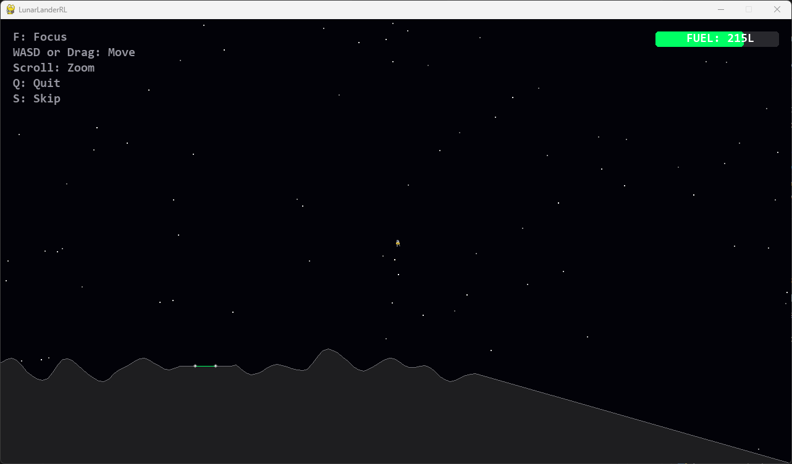

# 🚀 Lunar Lander RL

A reinforcement learning playground for a custom Lunar Lander-style environment built around DQN variants.



## ✨ What This Project Does

This repository trains and evaluates agents against the custom `VastSpaceLander` environment.
It includes support for D3QN, Double DQN, and Dueling DQN, plus a playable demo mode that renders the lander in a pygame window.

## 🧭 Main Menu

Run `python main.py` and choose one of these options:

- `0` Quick Run: automatically launches the default `d3qn_model.pth` demo with no extra prompts.
- `1` Demo: choose a saved checkpoint, DQN settings, and episode count manually.
- `2` Train: choose a training mode and start a training session.

## 🪟 Virtual Environment Setup

Use a virtual environment before running the project. On Windows, the safest path is:

```powershell
python -m venv .venv
.\.venv\Scripts\Activate.ps1
python -m pip install --upgrade pip
pip install -r requirements.txt
```

If PowerShell blocks script execution, run this once in the same shell before activation:

```powershell
Set-ExecutionPolicy -Scope Process -ExecutionPolicy RemoteSigned
```

If you use Command Prompt instead of PowerShell, activate with:

```bat
.venv\Scripts\activate.bat
```

## ▶️ Run the App

After the venv is active, start the app from the repository root:

```bash
python main.py
```

For the fastest demo path, choose option `0`.

## 🎮 Demo Mode

Demo mode loads a checkpoint from `models/` and runs the lander in human-rendered mode.

The quick run path uses these defaults:

- checkpoint: `models/d3qn_model.pth`
- DQN settings: Double DQN on, Dueling on
- episodes: `10`

Use the manual demo path when you want to pick a different checkpoint or adjust the episode count.

## 🏋️ Training Mode

Training supports three named variants:

- `d3qn` for Double DQN plus Dueling heads.
- `double_dqn` for Double DQN without dueling.
- `dueling_dqn` for Dueling DQN without the Double DQN target update path.

You can also train all supported variants in sequence from the interactive flow.

Training is configured to run headless, so it does not need a desktop window.

## 📦 Key Entry Points

- `main.py` drives the interactive menu, quick run, demo launcher, and training flow.
- `src/game/environment.py` defines the custom environment and render hook.
- `src/train/trainer.py` contains the training loops and variant helpers.
- `models/` stores checkpoints, score arrays, and training logs.

The codebase is intentionally split into small modules so the internal structure can evolve without forcing the README to mirror every file.

## 📚 Requirements

Install the dependencies from `requirements.txt` inside the virtual environment.

The main runtime packages are `gymnasium[box2d]`, `torch`, `numpy`, `pandas`, `pygame`, and `tqdm`.
A working Box2D-capable environment is required for the custom lander simulation.

## 📤 Outputs

Training writes artifacts into `models/`.

- `*_model.pth` files store checkpoints.
- `*_scores.npy` files store score history for evaluation.
- `*_training_log.csv` files store episode logs.
- `training_log.csv` is the default consolidated log produced by training runs.

Existing sample artifacts in the repository can be used immediately for demo playback or further training.

## 🛠️ Troubleshooting

- If the demo window does not appear, make sure you launched the app from the project root and that the venv is active.
- If PowerShell blocks activation, run `Set-ExecutionPolicy -Scope Process -ExecutionPolicy RemoteSigned` first.
- If Box2D installation fails, reinstall dependencies in a clean venv and upgrade `pip` before running `pip install -r requirements.txt`.
- If demo mode cannot find a checkpoint, confirm that `models/d3qn_model.pth` or another `.pth` file exists in `models/`.
- If imports fail, verify that you are running commands from the repository root after activating the venv.

## 💡 Tips

- Use a smaller episode count when smoke-testing a code change.
- Keep `reset=False` if you want to continue from an existing checkpoint.
- Use `reset=True` when you want to discard prior progress and start fresh.
- Watch the CSV logs if you want a quick view of reward trends over time.
